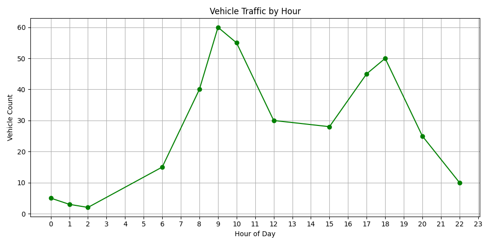
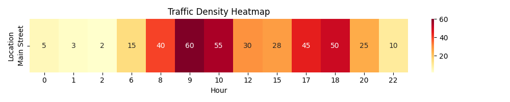

# 🚦 Project 7: Traffic Pattern Analysis

## 🎯 Objective
To analyze vehicle traffic trends and find peak congestion hours using time-series data.

## 🛠️ Tools Used
- Python
- pandas
- matplotlib
- seaborn

## 📁 Dataset
- Fields: Time Slot, Vehicle Count, Location
- Time Range: 00:00 to 22:00

## 📊 Key Insights
- Line graph shows hourly vehicle volume
- Heatmap highlights traffic density across the day

## 📸 Output
  

## 👩‍💻 Author
Suparna Chaudhari 
